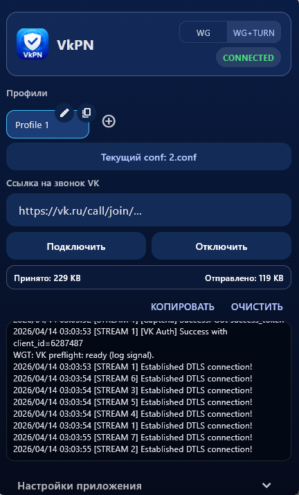
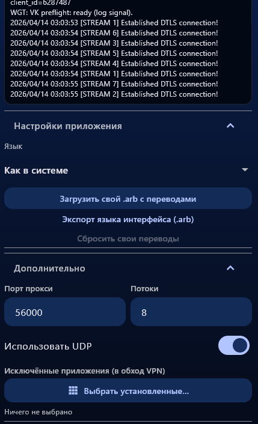

# VkPN

<p align="center">
  
  &nbsp;&nbsp;
  
</p>

*Скриншоты: Windows, десктоп (окно из области уведомлений).*

---

## Важно: конфиг WireGuard

**В приложение нужно подставлять обычный «настоящий» конфиг WireGuard** — такой же, как если бы вы подключались стандартным клиентом к серверу без VkPN. Не нужно заранее подменять endpoint на `127.0.0.1`: приложение **само** знает, как в режиме **WG+TURN** направить трафик через локальный клиент vk-turn.

### Секция `[Peer]` и поле `Endpoint`

В **`Endpoint`** должны быть **реальный адрес сервера** и **порт самого WireGuard** на этой машине (там, где у вас развернуты WireGuard и связка с turn-proxy):

```ini
Endpoint = <ip_или_домен_сервера>:<wg_port>
```

- **`<ip_или_домен_сервера>`** — хост, где крутится WireGuard и ваш сценарий с vk-turn-proxy (тот же VPS/узел, к которому вы подключаетесь по WG).
- **`<wg_port>`** — порт **сервера WireGuard** (UDP), как в обычном `ListenPort` / peer endpoint.  
  Это **не** порт локального прокси vk-turn на клиенте (часто в примерах фигурируют значения вроде `9000` / «порт прокси») и **не** порт turn-proxy как отдельная путаница — в `Endpoint` нужен именно **WG-порт на удалённой стороне**, чтобы конфиг оставался совместимым с любым другим WireGuard-клиентом.

Так сделано **для максимальной совместимости**: вы можете взять тот же `.conf`, что используете на телефоне или в `wg-quick`, и загрузить его в VkPN без ручной «магии» в секции Peer.

### Почему не стоит оставлять в файле `Endpoint = 127.0.0.1:9000`

Строка вида **`Endpoint = 127.0.0.1:9000`** в импортируемом конфиге **не считается корректным описанием сервера** для VkPN: она отражает уже **локальную** схему («peer смотрит на локальный прокси»), а не адрес вашего узла в сети. **Исправьте `Endpoint` на формат выше** (`сервер:wg_port`).  

Дальше приложение само:

- в режиме **только WG** использует этот endpoint (через свои настройки при необходимости);
- в режиме **WG+TURN** поднимает vk-turn локально, **переписывает** рабочий конфиг так, чтобы WireGuard ходил на локальный слушатель, и при этом опирается на **реальный** хост/порт из исходного `Endpoint` и настройки TURN (ссылка VK, `#@wgt` и поля в UI).

То есть **в исходном файле, который вы импортируете**, peer должен указывать на **настоящий сервер WireGuard**, а не на `127.0.0.1:9000` как на «финальный» адрес в интернете.

---

Сотрудничество и коллаборации: tg @R_NBAH

Спасибо авторам исходных проектов, на которых основана идея и клиентская часть:

- **[vk-turn-proxy](https://github.com/cacggghp/vk-turn-proxy)** — сервер и Go-клиент, проброс трафика WireGuard через TURN VK-звонков (DTLS, STUN ChannelData и т.д.).
- **[vk-turn-proxy-android](https://github.com/MYSOREZ/vk-turn-proxy-android)** — нативное Android-приложение под тот же сценарий, от которого в том числе отталкивалась архитектура VkPN.

> Проекты выше и сценарий использования описаны как **учебные**. **Само приложение VkPN предназначено только для учебных целей.** Используйте его только в рамках применимого законодательства и правил сервисов.

## Лицензия

Код VkPN распространяется на условиях [**GNU General Public License v3.0**](LICENSE) (GPL-3.0). Полный текст лицензии — в файле [`LICENSE`](LICENSE).

---

## Статус тестирования

Приложение **оттестировано и проверено в реальных сценариях** на **Android** и **Windows** (подключение WireGuard и режим **WG+TURN**, туннели и клиент vk-turn, интерфейс в трее).  
**iOS / macOS / Linux** по-прежнему собираются и описаны в коде, но **не имеют такого же уровня полевой проверки**, как две платформы выше (см. таблицу ниже).

---

## Что это за приложение

**VkPN** — кроссплатформенное приложение на **Flutter** с нативными модулями. Оно объединяет:

1. **WireGuard** — зашифрованный туннель до вашего сервера (как в обычном WG-клиенте).
2. **Режим «WG + VK TURN»** — локально поднимается клиент **vk-turn** (из экосистемы [vk-turn-proxy](https://github.com/cacggghp/vk-turn-proxy)): трафик WG идёт на `127.0.0.1:9000`, а клиент пересылает его на ваш VPS через TURN, используя **ссылку на VK-звонок** для получения учётных данных TURN.

Идея совпадает с README upstream: в клиентском конфиге WireGuard **endpoint** по сути указывает на **локальный** прокси (`127.0.0.1` и порт), а на сервере слушает связка **vk-turn server → WireGuard**.

---

## Как это устроено внутри (логика)

### Конфиг WireGuard

- В приложение можно вставить текст конфига **вручную** или **загрузить файл** (`.conf` / `.txt`). Поддерживается **несколько сохранённых профилей** (переключение на экране).
- Парсер разбирает секции `[Interface]` и `[Peer]`, проверяет обязательные поля.
- В режиме **WG + TURN** адрес `vk-turn` на стороне сервера задаётся так:
  - если в конфиге есть комментарии **`#@wgt:`** (см. ниже) и указан **`IPPort`**, используются **хост и порт из `IPPort`**;
  - иначе **хост** берётся из `Endpoint` в `[Peer]`, а **порт прокси** — из поля **«Порт прокси»** в приложении (по умолчанию **56000**), как в оригинальной схеме vk-turn.

#### Расширения `#@wgt` в `.conf`

Формат совместим с описанием в проекте **[wireguard-turn-android](https://github.com/kiper292/wireguard-turn-android)** (комментарии-метаданные в стиле `#@wgt:Key = Value` рядом с `[Peer]`):

```ini
[Peer]
Endpoint = 127.0.0.1:9000
# [Peer] TURN extensions
#@wgt:EnableTURN = true
#@wgt:UseUDP = false
#@wgt:IPPort = 185.50.203.4:56000
#@wgt:VKLink = https://vk.com/call/join/...
#@wgt:StreamNum = 4
#@wgt:LocalPort = 9000
```

**Приоритет:** значения из `#@wgt` в активном профиле **перекрывают** поля в UI (ссылка VK, UDP, потоки, локальный порт listen и т.д.), если они заданы в конфиге.

Поддерживается разбор перечисленных в upstream ключей (`EnableTURN`, `UseUDP`, `IPPort`, `VKLink`, `Mode`, `PeerType`, `StreamNum`, `LocalPort`, `StreamsPerCred`, `TurnIP`, `TurnPort`, `WatchdogTimeout`, …).  
**Фактическое применение** к процессу `vk-turn` в VkPN ограничено возможностями текущего клиента (флаги `-peer`, `-vk-link`, `-listen`, `-n`, `-udp`): параметры вроде `Mode`, `PeerType`, `TurnIP`/`TurnPort`, `WatchdogTimeout` и др. **пока не пробрасываются** в нативный слой — при импорте они не ломают конфиг, в логах может появиться предупреждение `WGT: … (not applied in this VkPN build)`.

#### Язык и свои переводы

- В **Настройках приложения** можно выбрать **English** / **Русский** или оставить **как в системе**; при загруженном custom `.arb` доступен пункт **«Свой .arb»** — тогда для `MaterialApp` используется язык из поля **`@@locale`** в этом файле.
- Можно **загрузить файл `.arb`** с переводами (те же ключи, что в `lib/l10n/app_en.arb`). Строки подмешиваются поверх встроенных через `CustomArbScope` / `tr()`.
- **Экспорт** сохраняет один файл `.arb` для **текущего языка интерфейса**: шаблон `app_en` / `app_ru` из assets плюс ваши переопределения.

### В режиме «только WG»

- Поднимается только туннель WireGuard с **оригинальным** конфигом (endpoint → `host:proxyPort` или иной согласованный с сервером вариант).
- **VK TURN** не используется.

### В режиме «WG + VK TURN»

1. **vk-turn client** подключается к TURN по данным из **ссылки на звонок VK** (`-vk-link`), слушает локально (например `127.0.0.1:9000`).
2. **WireGuard** поднимается с конфигом, где peer смотрит на этот локальный адрес, чтобы весь WG-трафик шёл в клиент vk-turn, а дальше — на VPS через TURN.

На **Android** это делается нативно: отдельный процесс/сервис для vk-turn и менеджер туннеля WireGuard (см. Kotlin-модули `VpnRuntime`, `WireGuardTunnelManager`, `VkTurnProcessManager`, foreground service).

На **Windows / macOS** в режиме WG+TURN из assets распаковывается бинарник клиента и запускается как процесс; WireGuard идёт через плагин `wireguard_flutter_plus`.

---

## Как пользоваться интерфейсом

Экран одной страницы, сверху вниз:

1. **Шапка** — логотип, название, переключатель **WG** / **WG + TURN**, бейдж статуса подключения.  
   Если конфиг пустой, показывается предупреждение; ошибки подключения — **красным** текстом под блоком.

2. **Профили** — горизонтальный список карточек: выбор активного профиля, **+** (новый), копия (дублировать).  
   На карточке: **карандаш** (переименовать) и **корзина** (удалить, если профилей больше одного); иконки в кружках у верхнего края карточки.

3. **Импорт WireGuard** — кнопка выбора файла `.conf` / `.txt` (подпись: импорт или «текущий conf: …»).

4. **Ссылка на VK-звонок** — одно поле; для режима **WG + TURN** обязательна (можно дублировать `#@wgt:VKLink` из конфига).

5. **Connect / Disconnect** — подключение и отключение туннеля.

6. **Трафик и логи** — в одной строке счётчики **принято** и **отправлено**; ниже панель логов: справа кнопки **копировать** / **очистить**, под ними прокручиваемое окно вывода (тёмный фон со скруглением только у области текста).

7. **Настройки приложения** (раскрывающийся блок)  
   - **Язык**: как в системе, English, Русский; при загруженном своём `.arb` — пункт **«Свой .arb»** / **«Custom .arb»** (локаль интерфейса берётся из поля `@@locale` в этом файле).  
   - Загрузка / сброс своего `.arb`, **экспорт** текущего языка в один файл `.arb` (системный диалог «Сохранить»).  
   - Остальное: **Дополнительно** — порт прокси, потоки, UDP, исключённые приложения.

**Загрузка конфига:** текст можно править в связанном с профилем состоянии; файл выбирается через системный диалог. На Android при необходимости содержимое читается с диска по пути к файлу, если плагин не отдал байты в память.

**Релизы:** список изменений по версиям — в [`CHANGELOG.md`](CHANGELOG.md); при сборке релиза в GitHub Actions описание подставляется из соответствующей секции файла.

---

## Платформы: что задумано и в чём отличия

| Платформа | Поддержка в коде | Особенности                                                                                                                                                                                                                                                                                            |
|-----------|------------------|--------------------------------------------------------------------------------------------------------------------------------------------------------------------------------------------------------------------------------------------------------------------------------------------------------|
| **Android** | Полный цикл: **WireGuard + vk-turn**, foreground service, логи, статистика трафика | **Оттестировано «в бою».** Нужны разрешения VPN и стабильная работа в фоне (желательно отключить оптимизацию батареи для приложения).                                                                                                                                                                        |
| **iOS** | WireGuard через **Network Extension** (Packet Tunnel), плагин `wireguard_flutter_plus` | **Симулятор iOS:** VPN/NE **не работает** (ограничение Apple). **Нужен** физический iPhone и **платная** подписка Apple Developer Program с capability **Network Extensions** (бесплатная Personal Team **не** подходит). Режим **WG + TURN** в UI для iOS **пока отключён** (сообщение в приложении). |
| **macOS** | WireGuard через тот же плагин; WG+TURN — запуск бинарника `client-darwin-*` из assets | Минимальная версия ОС в проекте поднята **до 12.0+** из‑за требований плагина. **Network Extensions** и подпись: **бесплатная** команда разработчика **не** выдаёт профили с NE — нужна **платная** подписка Apple Developer. Возможны запросы **System Extension / VPN** в настройках системы.        |
| **Windows** | WireGuard + при WG+TURN процесс `client-windows-amd64.exe`; интерфейс в **системном трее** (без отдельной кнопки на панели задач) | **Оттестировано «в бою»** (в т.ч. WG+TURN, DTLS/TURN). Для маршрутов и привилегий в типичном сценарии нужны **права администратора** (UAC); приложение может запрашивать повышение при старте.                                                                                                               |
| **Linux** | В репозитории есть **цель `linux/`** Flutter, но **отдельный** нативный мост под тот же API, что Android, **не** дублирует полностью Android-стек; фактическая работа WireGuard + vk-turn **не проверялась** в рамках этого README. | Для запуска «как на десктопе» вручную по-прежнему можно использовать схему из [vk-turn-proxy](https://github.com/cacggghp/vk-turn-proxy) (`client-linux` + `routes.sh` и т.д.).                                                                                                                        |

---

## Сборка (кратко)

- Flutter SDK, в проекте: `flutter pub get`.  
- Перед сборкой Android, macOS или Windows скачайте upstream-бинарники: `bash scripts/fetch_vkturn_binaries.sh all`.  
- **Android:** `flutter build apk` / запуск из IDE.  
- **iOS / macOS:** Xcode, CocoaPods (`pod install` в `ios/` или `macos/`), подпись и capabilities по таблице выше.  
- **Windows:** Visual Studio / CMake, как в стандартной инструкции Flutter для Windows.

---
